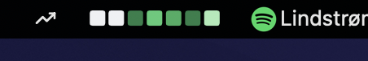
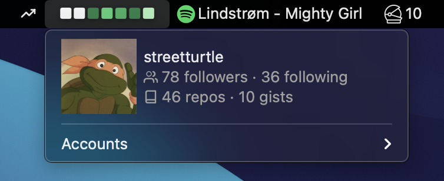
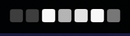
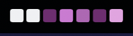
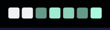

# GitHub Contributions

A menubar app, which shows github contributions chart for the last 7 days, similar to the one on the github's user page:

When clicked it shows some information about the user:

## Themes

The app can be customized and use one of the following themes

| theme name | screenshot |
|---|---|
| classic |  |
| dracula |  |
| leftpad |  |
| pink |  |
| teal |  |

# Installation 

TDB